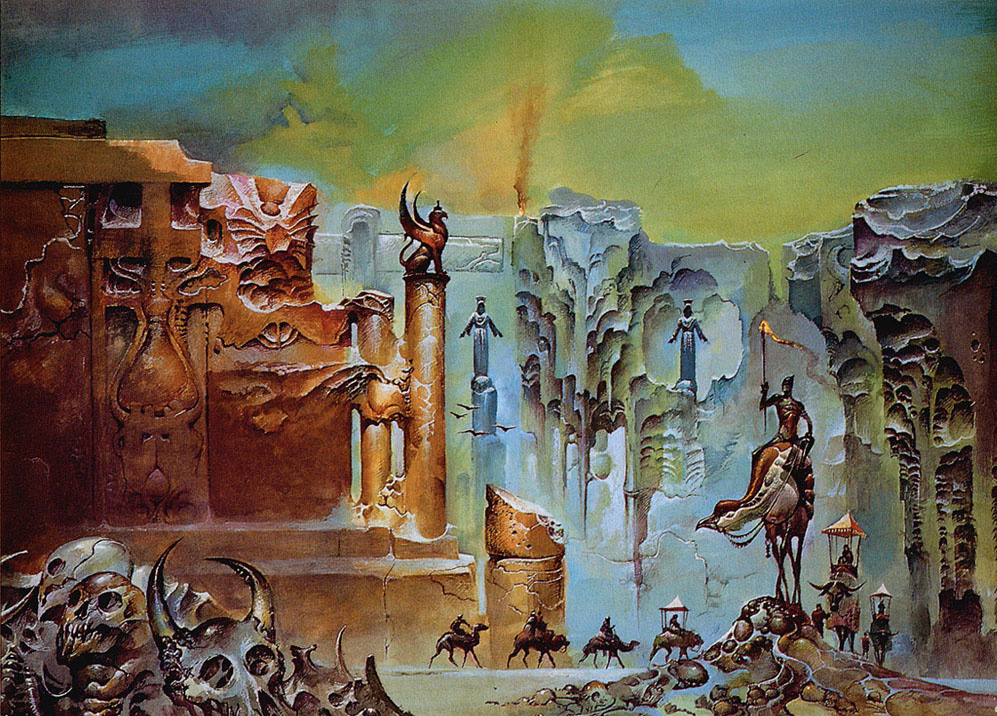

# Avern Engine

> Frontend



Opinionated framework for turn-based RPGs in the browser.

Live demo [here](https://avern-frontend.vercel.app/)

## Features

- Create gameObjects and attach components to them
- Character controller and input handling
- Support for Active Time Battle RPG combat
- Raycasting with [three-mesh-bvh](https://github.com/gkjohnson/three-mesh-bvh)
- Content managed via [Avern Engine backend](https://github.com/nsmarino/avern-backend) (Sanity Studio)
- Powered with [Vite](https://vite.dev/)
- Shader support (glsl) with[vite-plugin-glsl](https://github.com/UstymUkhman/vite-plugin-glsl)

### Use it

```
yarn dev
```

### Build it

```
yarn build
```

Builds the app for production to the `dist` folder.<br>

The build is minified and the filenames include the hashes.<br>